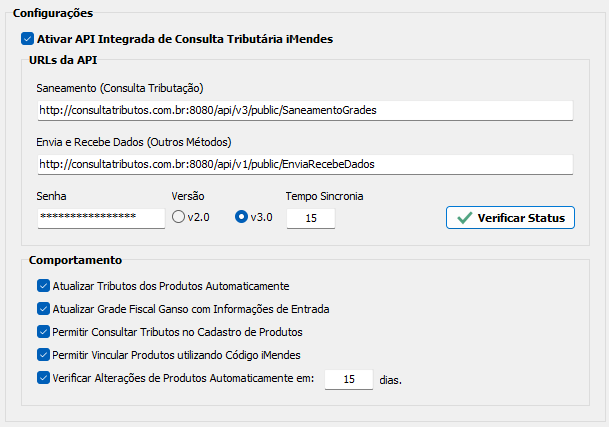

# Requisitos - Integração Consulta Tributária Ganso iMendes
---
# Sumário
- [Sumário](#sumário)
- [Introdução](#introdução)
- [Requisitos Iniciais](#requisitos-iniciais)
  - [Cadastro de Empresas](#cadastro-de-empresas)
  - [Parâmetros do Sistema](#parâmetros-do-sistema)
  - [Exemplo de Tela de Configurações e Parâmetros:](#exemplo-de-tela-de-configurações-e-parâmetros)
- [Requisitos Específicos](#requisitos-específicos)
  - [Consulta Tributos - Cadastro de Produtos](#consulta-tributos---cadastro-de-produtos)
    - [Fluxo de Consulta](#fluxo-de-consulta)
    - [Fluxograma da Consulta Tributação](#fluxograma-da-consulta-tributação)
  - [Consulta Tributos - Gerenciador de Tributação](#consulta-tributos---gerenciador-de-tributação)
    - [Métodos Básicos](#métodos-básicos)
    - [Métodos Avançados](#métodos-avançados)

# Introdução

- O presente documento objetiva descrever em detalhes os processos e meios para integração da Consulta Tributária iMendes no Sistema Ganso. 
- Nesta integração, o Sistema Ganso comunica-se com o portal tributário do Grupo iMendes através de uma **API**, e realiza a consulta da Tributação dos produtos e retorna as informações. 
- A consulta pode ocorrer de duas maneiras: **durante a realização de um novo Cadastro** ou **consultando a tributação de um produto Cadastrado** 
- Para que a integração seja bem sucedida, é necssário que o CNPJ do estabelecimento consulente (Cliente que realizará as consultas) esteja liberado mediante aquisição de licença com o Setor Comercial do Grupo iMendes. (Levando em consideração que a Ganso Sistemas seja um parceiro ativo).

# Requisitos Iniciais
Nesta seção, serão descritos os requisitos iniciais e obrigatórios para a continuidade do processo de integração, e descreve os principais parâmetros de Configuração. 
- Para o correto funcionamento das Requisições à API iMendes, dados do Emitente da Consulta são necessários e a maioria deles estão disponíveis no Cadastro de Empresa e nos Parâmetros do Sistema Ganso. Contudo, há necessidade em criar Estruturas para as seguintes informações abaixo:

## Cadastro de Empresas

Tipo | Rotina/Recurso | Descritivo
:------|:------|:------
**Caixa de Combinação** | Regime Tributário | Campo para informar a Subclassificação do CRT que pode ser definida entre **Lucro Real - LR** ou **Lucro Presumido - LP**. Deve ser ativado apenas se o CRT selecionado for igual a 3. *Informação obrigatória para envio da requisição*

## Parâmetros do Sistema
Tipo de Elemento | Pai | Nome/Texto | Descritivo
:----------- | :------ |:------ |:------
**Caixa de Seleção** | - | Ativar Integração de Consulta Tributária iMendes | Parâmetro Global para ativação das configurações da API
**Grupo** | - | URLs da API | Organiza os campos de Configuração necessários para conectividade com o Servidor.
**Campo Texto** | **URLs da API** | Saneamento (Consulta Tributação) | Campo para infomrar a URL da API que retorna Dados da Tributação do produto consultado. Tamanho máximo de 255 caracteres
**Campo Texto** | **URLs da API** | Envia e Recebe Dados (Outros Métodos) | Campo para informar a URL da API que recebe os comandos extras e retorna produtos alterados. Tamanho máximo de 255 caracteres
**Campo Texto Mascarado** | **URLs da API** | Senha | Campo para Senha do Usuário Integrado. Tamanho máximo de 20 caracteres, sem validações. 
**Botão de Seleção** | **URLs da API** | Versão | Seleção da Versão da API contratada. Disponibilizar as versões 2.0 e 3.0 de seleção única (somente uma das opções pode ser selecionada)
**Campo Texto** | **URLs da API** | Tempo de Resposta | Timeout ou Tempo de Resposta máximo da API. Deve ser numérico e interpretado como "segundos". Valor padrão: 15 segundos
**Botão** | **URLs da API** | Verificar Status | Botão para verificação da Conectividade com as APIs. Deve retornar uma mensagem de Sucesso ou Falha, para ambas APIs.
**Grupo** | - | **Comportamento** | Organiza os parâmetros que definem as regras de funcionamento da integração e automatismos.
**Caixa de Seleção** | **Comportamento** | Atualizar Tributos dos Produtos Automaticamente | Permite atualização automatizada dos tributos de produtos ao consultar um Produto ou Receber atualizações em lote através do *Gerenciador Tributário*
**Caixa de Seleção** | **Comportamento** | Atualizar Grade Fiscal Ganso com Informações de Entrada Consultadas | Permite criar Regras Fiscais Ganso através das informações tributárias coletadas em consultas.
**Caixa de Seleção** | **Comportamento** | Permitir Consultar Tributos no Cadastro de Produtos | Permite ao usuário efetuar a consulta iMendes durante o Cadastramento de Novo Produto ou Atualização de um Produto Cadastrado.
**Caixa de Seleção** | **Comportamento** | Permitir Vincular Produtos utilizando Código iMendes | Permite ao usuário vincular um Produto Cadastrado com um Produto iMendes Consultado por Descrição.
**Caixa de Seleção** | **Comportamento** | Verificar Alterações de Produtos Automaticamente em: [ x ] dias. | Parâmetro para definir a periodicidade de consulta à atualizações de grades realizadas pelo iMendes. Deve ser numérico e interpretado como "dias". Valor padrão: 15 dias

## Exemplo de Tela de Configurações e Parâmetros: 
  
   

[Voltar ao Sumário](#sumario)

# Requisitos Específicos
Nesta seção, serão descritos os Requisitos necessários para atender à Homologação e aos Recursos mais importantes desta integração, que são:
- Funcionalidades Básicas.
- Funcionalidades Extras.
- Controle de Acesso e Acessos Restritos (Operações Especiais).
- Verificação de Conformidade com a Estrutura MVP sugerida pela iMendes.

## Consulta Tributos - Cadastro de Produtos
### Fluxo de Consulta
Conforme documentação disponibilizada pela iMendes, uma boa prática é fornecer ao Usuário um método de Consulta de Tributos no Cadastro do Produto, em dois momentos:
   1. Durante o Cadastramento de um Novo Produto;
   2. Durante o processo de Atualização de um Produto já Cadastrado.

Analisando a Estrutura de envio de Requisição, um processo comum é executado e orientado conforme os seguintes passos:
  1. Prepara a Requisição JSON, utilizando os dados do Emitente, Perfil e Produto.
     1. O Perfil possui informações chave que são:
        - UF = UF do Emitente
        - CFOP = 5102 (Operação Interna de Venda)
        - Característica Tributária = 8 (Consumidor Final Pessoa Física)
        - Finalidade = 0 (Revenda)
     2. O Produto pode ser enviado por três métodos:
        1. **Código de Barras (EAN/GTIN) e Descrição**. Identificar se o Código de Barras informado possui 8, 12, 13 ou 14 dígitos e se é um Código de Barras válido.
           1. Se Código de Barras é um GTIN válido e não iniciar com 789 ou 790, em Perfil, enviar "origem" igual a 8.
        2. **Apenas Descrição (Método Consulta Produtos iMendes)**. Quando produto não possuir Código de Barras EAN/GTIN ou em branco, e não estiver vinculado a um Código iMendes. 
        3. **Código iMendes e Descrição**. Enviar o EAN/GTIN, Descrição e Código iMendes vinculado.
   2. Realiza a Conexão com API
      1. Se método de consulta igual a 1 (Código de Barras e Descrição), enviar o Código de Barras e Descrição informados durante o Cadastramento.
      2. Se método de consulta igual a 2 (Apenas descrição), utilizar o método "Produtos iMendes" enviando apenas a descrição informada pelo Usuário.
         1. Fornecer ao Usuário um meio de selecionar um Produto localizado pela Descrição (em uma lista), e permitir vinculá-lo ao seu Cadastro utilizando o Código iMendes. O usuário poderá vincular apenas 1 Código iMendes por Produto cadastrado.
         2. Executar a Consulta de Tributação utilizando o Código iMendes vinculado. 
      3. Se método de consulta igual a 3 (Código iMendes), em Produtos, enviar preenchido o campo "CodIMendes" e a Descrição do Produto.
   2. Captura o Retorno da Tributação para a Operação padrão
   3. Efetua a Gravação de Logs de Consulta, Dados de Retorno e Produtos Alterados.

### Fluxograma da Consulta Tributação
- 

[Voltar ao Sumário](#sumario)

## Consulta Tributos - Gerenciador de Tributação
### Métodos Básicos
### Métodos Avançados
