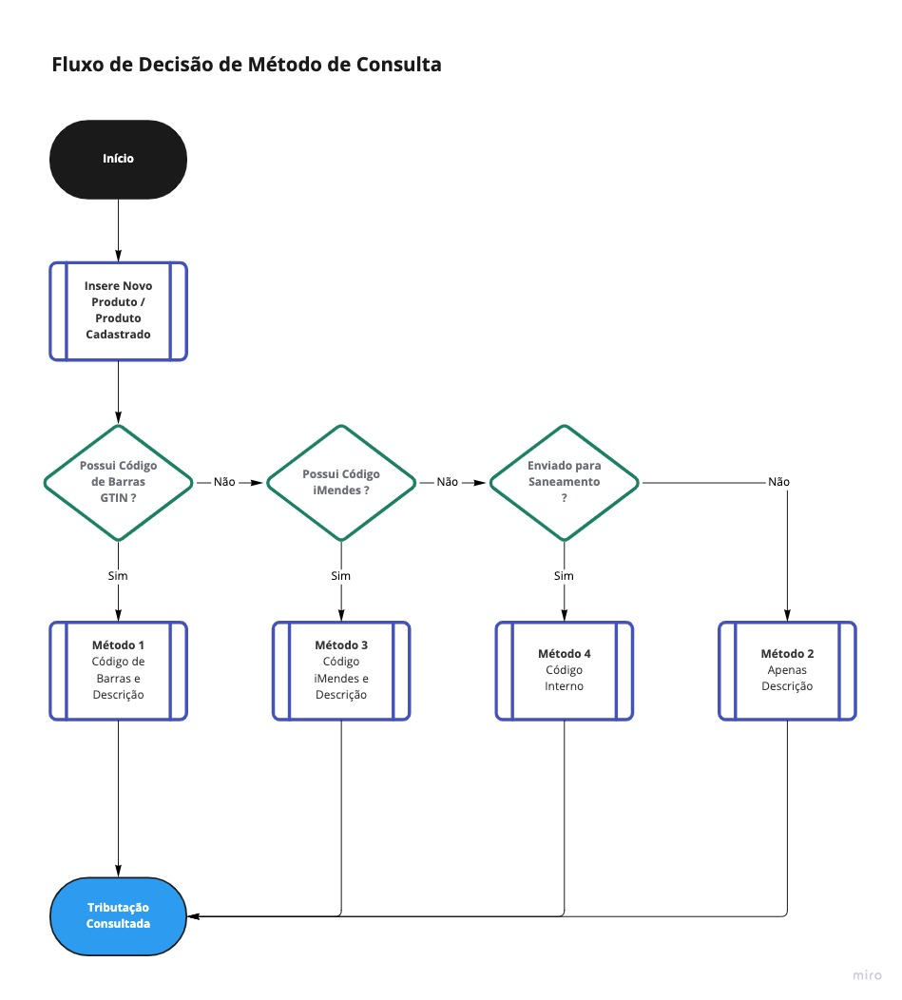
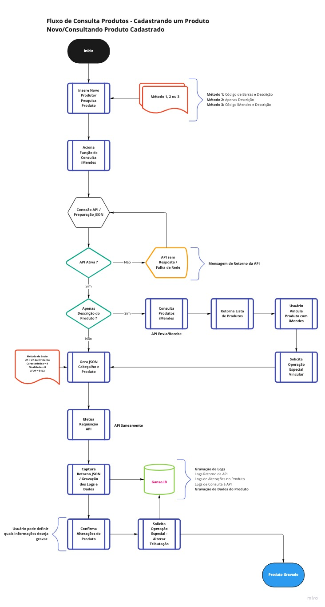

# Requisitos - Integração Consulta Tributária Ganso iMendes
---
Índice

- [Introdução](#introdução)
- [Requisitos Iniciais](#requisitos-iniciais)
  - [Cadastro de Empresas](#cadastro-de-empresas)
  - [Parâmetros de Comunicação](#parâmetros-de-comunicação)
  - [Regras Parametrizáveis](#regras-parametrizáveis)
- [Requisitos Específicos](#requisitos-específicos)
  - [Recurso 1 - Consulta Tributos - Cadastro de Produtos](#recurso-1---consulta-tributos---cadastro-de-produtos)
    - [Fluxo de Consulta](#fluxo-de-consulta)
    - [Requisitos da Operação](#requisitos-da-operação)
      - [Funções Necessárias](#funções-necessárias)
      - [Campos Necessários](#campos-necessários)
      - [Tipos de Consulta](#tipos-de-consulta)
      - [Fluxo de Decisão do Método de Consulta](#fluxo-de-decisão-do-método-de-consulta)
      - [Perfil de Envio](#perfil-de-envio)
      - [Composição da Requisição - Resumo da Operação de Consulta](#composição-da-requisição---resumo-da-operação-de-consulta)
  - [Captura do Retorno das Informações](#captura-do-retorno-das-informações)
    - [Histórico de Consultas](#histórico-de-consultas)
      - [Atualizações Tributárias](#atualizações-tributárias)
    - [Relacionamento de Dados - Retorno iMendes x Ganso](#relacionamento-de-dados---retorno-imendes-x-ganso)
      - [Destino: Tabela Produto](#destino-tabela-produto)
      - [Destino: Tabela Produto Parâmetros](#destino-tabela-produto-parâmetros)
  - [Recurso 2 - Consulta Tributos em Lote - Gerenciador de Tributação](#recurso-2---consulta-tributos-em-lote---gerenciador-de-tributação)
    - [Regras da Consulta em Lote](#regras-da-consulta-em-lote)
    - [Métodos Básicos](#métodos-básicos)
    - [Métodos Avançados](#métodos-avançados)
  - [Controle de Acesso e Acessos Restritos](#controle-de-acesso-e-acessos-restritos)
  - [Tabela de Validações do MVP](#tabela-de-validações-do-mvp)
  - [Relatórios Gerenciais - Logs](#relatórios-gerenciais---logs)

# Introdução

- O presente documento objetiva descrever em detalhes os processos e meios para integração da Consulta Tributária iMendes no Sistema Ganso. 
- Nesta integração, o Sistema Ganso comunica-se com o portal tributário do Grupo iMendes através de uma **API**, e realiza a consulta da Tributação dos produtos e retorna as informações. 
- A consulta pode ocorrer de duas maneiras: **durante a realização de um novo Cadastro** ou **consultando a tributação de um produto Cadastrado** 
- Para que a integração seja bem sucedida, é necessário que o CNPJ do estabelecimento consulente (Cliente que realizará as consultas) esteja liberado mediante aquisição de licença com o Setor Comercial do Grupo iMendes. (Levando em consideração que a Ganso Sistemas seja um parceiro ativo).

# Requisitos Iniciais
Nesta seção, serão descritos os **Requisitos Iniciais e Obrigatórios** para a continuidade do processo de integração, e descreve os principais parâmetros de Configuração. 
- Para o correto funcionamento das Requisições à API iMendes, dados do Emitente da Consulta são necessários e a maioria deles estão disponíveis no Cadastro de Empresa do Sistema Ganso. Contudo, há necessidade em criar estruturas complementares para as seguintes informações abaixo:

## Cadastro de Empresas
Nome/Texto | Descritivo | Validações | Obrigatório
|:------|:------|:-------|:-----:
Regime Tributário | Campo para informar a Subclassificação do CRT Regime Normal que pode ser definida entre **Lucro Real - LR** ou **Lucro Presumido - LP**. | Deve ser ativado apenas se o CRT selecionado for igual a 3 - Regime Normal. | **Sim**

## Parâmetros de Comunicação
São dados necessários para efetuar a comunicação com os Servidores da iMendes. Abaixo estão descritos quais informações devem ser criadas e suas funções.

Tipo de Elemento | Pai | Nome/Texto | Descritivo
:-----------|:------|:------|:------
**Caixa de Seleção** | - | Ativar Integração de Consulta Tributária iMendes | Parâmetro Global para ativação das configurações da Integração com o Sistema
**Grupo** | - | URLs da API | Organiza os campos de Configuração necessários para conectividade com o Servidor.
**Campo Texto** | **URLs da API** | Saneamento (Consulta Tributação) | Campo para informar a URL da API que retorna Dados da Tributação do produto consultado. Tamanho máximo de 255 caracteres
**Campo Texto** | **URLs da API** | Envia e Recebe Dados (Outros Métodos) | Campo para informar a URL da API que recebe os comandos extras e retorna produtos alterados. Tamanho máximo de 255 caracteres
**Campo Texto Mascarado** | **URLs da API** | Senha | Campo para Senha do Usuário Integrado. Tamanho máximo de 20 caracteres, sem validações. 
**Botão de Seleção** | **URLs da API** | Versão | Seleção da Versão da API contratada. Disponibilizar as versões 2.0 e 3.0 de seleção única (somente uma das opções pode ser selecionada)
**Campo Texto** | **URLs da API** | Tempo de Resposta | Timeout ou Tempo de Resposta máximo da API. Deve ser numérico e interpretado como "segundos". Valor padrão: 15 segundos
**Botão** | **URLs da API** | Verificar Status | Botão para testar a Conectividade com as APIs utilizando os dados informados. Deve retornar uma mensagem de Sucesso ou Falha, para ambas APIs.

## Regras Parametrizáveis
Tipo de Elemento | Pai | Nome/Texto | Descritivo
:--------|:------|:------|:------
**Grupo** | - | **Comportamento** | Organiza os parâmetros que definem as regras de funcionamento da integração e automatismos.
**Caixa de Seleção** | **Comportamento** | Atualizar Tributos dos Produtos Automaticamente | Permite atualização automatizada dos tributos de produtos ao consultar um Produto ou Receber atualizações em lote através do *Gerenciador Tributário*
**Caixa de Seleção** | **Comportamento** | Atualizar Grade Fiscal Ganso com Informações de Entrada Consultadas | Permite criar Regras Fiscais Ganso através das informações tributárias de Entrada coletadas em consultas.
**Caixa de Seleção** | **Comportamento** | Permitir Consultar Tributos no Cadastro de Produtos | Permite ao usuário efetuar a consulta iMendes durante o Cadastramento de Novo Produto ou Atualização de um Produto Cadastrado.
**Caixa de Seleção** | **Comportamento** | Permitir Vincular Produtos utilizando Código iMendes | Permite ao usuário vincular um Produto Cadastrado com um Produto iMendes Consultado por Descrição.
**Caixa de Seleção** | **Comportamento** | Verificar Alterações de Produtos Automaticamente em: [ x ] dias. | Parâmetro para definir a periodicidade de consulta à atualizações de grades realizadas pelo iMendes. Deve ser numérico e interpretado como "dias". Valor padrão: 15 dias
**Caixa de Seleção** | **Comportamento** | Permitir Atualização Parcial das Informações Tributárias do Produto | Parâmetro para definir se o usuário terá permissão em aceitar apenas campos específicos da Tributação consultada. Quando esta opção está desativada, não será permitido desmarcar campos na Tela exibição dos Tributos consultados

[Voltar ao Sumário](#sumario)

# Requisitos Específicos
Nesta seção, são descritos os **Requisitos Obrigatórios** para atender à Homologação e os Recursos mais importantes desta integração, que são:
- Consulta via Cadastro de Produtos - Cadastrando um Novo Item
- Consulta via Cadastro de Produtos - Atualizando informações de um Produto Cadastrado
- Consulta em Lote para vários Produtos e Envio do Cadastro Completo para iMendes
- Controle de Acesso e Acessos Restritos (Operações Especiais).
- Tabela de Verificação de Conformidade com a Estrutura MVP sugerida pela iMendes.

## Recurso 1 - Consulta Tributos - Cadastro de Produtos
### Fluxo de Consulta
Conforme documentação disponibilizada pela iMendes o Usuário deve conseguir efetuar Consulta de Tributos no Cadastro do Produto, em dois momentos:
   1. Durante o Cadastramento de um Novo Produto;
   2. Durante o processo de Atualização de um Produto já Cadastrado.

De modo simplificado, os passos são:
   1. Iniciar o Cadastro ou Consultar um Produto Cadastrado;
   2. Acionar a função para Consultar Tributação iMendes;
   3. Receber e visualizar o Retorno com a Tributação antiga e a Nova;
   4. Confirmar ou não as alterações.

### Requisitos da Operação
Para disponibilizar ao usuário o recurso, é necessário incluir **Funções no Cadastro de Produtos** para que sejam acionadas quando o usuário desejar, e novos Campos, conforme descritivo abaixo:

#### Funções Necessárias
Nome | Descritivo | Validações
:-----|:-----|:------
Consultar Tributação iMendes | Acionar a Consulta de Tributos na API iMendes | Solicitar Chave de Acesso Restrito para realizar a Consulta.
Consultar Histórico de Alterações Tributárias | Acionar a visualização do Histórico de Alterações do Produto | -
Desfazer Alterações Tributárias | Acionar função para usuário reverter dados Tributários alterados pelo iMendes consultando o Histórico e com possibilidade de escolha do ponto de reversão desejado | Solicitar Chave de Acesso Restrito

#### Campos Necessários
Tipo | Posicionamento | Nome/Texto | Descritivo | Validações
:------|:------|:------|:------|:------
**Campo**|**Grupo Dados do Produto**|Código iMendes| Campo para armazenar e exibir o Código iMendes quando ocorrer o vínculo efetuado pelo Usuário | Deve ser do Tipo Inteiro e Somente leitura.
**Campo** | A Definir |Auditado por iMendes| Campo para armazenar e exibir a informação de que o Produto teve a tributação auditada/atualizada pela iMendes. Complementar esta informação com a Data e Hora da última atualização tributária | Somente leitura e visualmente destacado
**Campo** | A Definir |Enviado para Saneamento| Campo para armazenar e exibir a informação quando o Produto foi enviado para a iMendes classificar e tributar. Será utilizado para identificar que produtos estão pendentes de tributação na iMendes, e como *flag* para apontar que precisa receber atualização. Complementar esta informação com a Data e Hora do envio | Somente leitura e visualmente destacado
**Caixa de Seleção** | A Definir | **Não tributar pelo iMendes** | Parâmetro para restringir a atualização de Tributos do Produto pelo iMendes. Por decisão do Usuário, alguns produtos podem ser tributados seguindo a sua própria interpretação. | Solicitar Acesso Restrito para ativar e desativar o parâmetro.

#### Tipos de Consulta
Além dos campos e funções, é necessário criar Métodos de Consulta que trata o **Comportamento do Usuário** e direciona a Consulta para o fluxo correto de consumo das APIs. Todos os métodos são requeridos, e a API retorna informações distintas conforme método utilizado que são:

Método | Tipo de Consulta | Descritivo | Validações | API a Consumir | Tags de Envio Principais
:------|:------|:------|:------|:------|:------
**Método 1** | **Código de Barras EAN/GTIN e Descrição** | Consultar a Tributação do Produto utilizando o Código de Barras EAN/GTIN e a Descrição do Produto | Identificar se o Código é um EAN válido, considerando tamanho de 8, 12, 13 ou 14 dígitos. Se EAN válido, identificar se o Prefixo do Código de Barras inicia em 789 ou 790, e enviar origem igual a 0, caso contrário enviar origem igual a 8. Capturar o retorno dos dados.| **Saneamento** |```"codigo":"EAN", "codInterno":"N", "codIMendes":"", "descricao":"DESCRICAO"```
**Método 2** |**Apenas Descrição** | Consultar a Tributação de um Produto utilizando a Descrição. Capturar a lista de Produtos semelhantes, e permitir vincular um Produto iMendes com o Produto corrente. | Permitir vincular apenas um Produto iMendes com um Produto cadastrado. Criar acesso restrito para esta operação. Identificar se o Produto está sem Código de Barras e não vinculado a um Código iMendes.|**Envia/Recebe Dados**| ```"nomeservico":"DESCPRODUTOS", "dados":"CNPJ\|DESCRICAO" ```
**Método 3** | **Código iMendes e Descrição** | Consultar a Tributação do Produto utilizando o Código iMendes previamente vinculado. Capturar o retorno normalmente como ocorre no Método 1 | Identificar se o Produto possui um Código iMendes, se sim, utilizar esta informação para localizar a tributação. | **Saneamento** | ```"codIMendes":"CODIGOVINCULADO", "descricao":"DESCRICAO"```
**Método 4** | **Código Interno** | Consultar a Tributação do Produto utilizando o Código Interno do Produto previamento classificado pela iMendes |Identificar se o possui o campo "Enviado para Saneamento" igual a "Sim" |**Saneamento**| ```"codInterno":"CODIGOINTERNO"```

#### Fluxo de Decisão do Método de Consulta
- 

Além dos Métodos de Consulta, outras informações que compõem o **Perfil** a ser consultado são necessárias para envio da Requisição. Estas informações foram classificadas e organizadas, e mesmo as não obrigatórias, devem ser enviadas com valores padrão. Conforme análise, o objetivo de Consulta através do Cadastro é obter dados para **Saída na Operação de Venda ao Consumidor (NFC-e)**, portanto os parâmetros definidos abaixo devem ser considerados em seus **Valores Padrão**:

#### Perfil de Envio
Dado | Tag | Tipo | Descritivo | Valor Padrão | Obrigatório
:----|:---|:------|:------|:-------:|:-------:
UF | ```"uf"``` | Lista de Dados | Lista de UFs para Consulta de Regras. | UF da Empresa Filial Logada |**Sim**
CFOP | ```"cfop"```| Código da Operação | Código da Operação a ser Realizada. Deve ser enviada uma operação coerente com os dados desejados, por exemplo, uma Operação de Venda deve conter um CFOP que indique operação de Venda, mesmo que este não seja o correto. | "5102" |**Sim**
Característica Tributária | ```"caracTrib"``` | Lista de Códigos Inteiros | Indica o Tipo de Destinatário da Operação | Código "8" |**Sim**
Finalidade | ```"finalidade"```| Código | Indica a Destinação do Produto para a Operação informada. É importante para especificar a operação. | Código "0" | Não
Simples Nacional | ```"simplesN"```| Caractere | Indica se o Destinatário da Operação é Simples Nacional ou Não. Preenchido com "S" ou "N". Se CRT da Empresa é igual a 1 ou 2, enviar "S", senão enviar "N". | "N" | Não
Origem |```"origem"``` | Código | Indica a Origem da Mercadoria. Se Tipo de Consulta igual a Método 1, e Código de Barras não iniciar em 789 ou 790, enviar Código 8. | Código "0" | **Sim**
Substituição Tributária | ```"substICMS"```| Caractere | Indica se o destinatário é Substituto Tributário. | "N" | Não

#### Composição da Requisição - Resumo da Operação de Consulta
1. Coleta dados do **Cadastro de Empresa** para gerar a gera a Tag ```"emit"```
3. Coleta dados do **Perfil de Envio** para gerar a Tag ```"perfil"```
4. Coleta dados do **Produto**, aplicando um dos **Métodos de Consulta** definidos em **Tipo de Consulta** para gerar a Tag ```"produtos"```
5. Enviar a Estrutura JSON de Requisição utilizando a **API** apontada no **Método de Consulta** utilizado. [Ver Métodos de Consulta](#tipos-de-consulta)

Após a obtenção dos Dados Necessários para envio da Requisição, o **Fluxo de Consulta** pode ser visualizado através do Esquema abaixo:   

- 

[Voltar ao Sumário](#sumario)
## Captura do Retorno das Informações
Após efetuar a Consulta e obter o retorno com os Dados Tributários, é necessário efetuar a Gravação de Histórico de Consulta. Abaixo são descritos quais são necessários:

### Histórico de Consultas
Nome do Histórico | Descritivo | Dados Principais
:----|:-----|:----
Consumo da API | Armanezenar todas as Consultas Realizadas por Usuário | Usuário, Data e Hora, CNPJ, Método de Consulta e Produtos Consultados
Retorno de Consulta | Armazenar os Retornos de cada Produto Consultado | Código de Produto, Data e Hora, Dados Completos Retornados da API, e informações invidivuais relacionadas com campos existentes no Sistema Ganso
Alterações de Produtos | Armazenar as Alterações Tributárias Promovidas pela iMendes relacionadas aos Produtos do Usuário | Código do Produto, Data e Hora, Dados Alterados para Consumo 
Dados Ignorados| Armazenar os Campos e Dados que foram ignorados pelo Usuário durante a Confirmação de Retorno | Armazenar por Produto e Usuário, Todos os campos e dados não selecionados pelo Usuário

Após captura e armazenamento dos dados consultados, um dos Requisitos para Homologação descreve que o Usuário precisa ter liberdade em **Aceitar** as atualizações Tributárias para o Produto total ou parcial, para gravá-las no Cadastro do Produto Consultado. Deste modo, é necessário exibir em Tela este retorno contendo todos os Dados **Antes e Depois**, destacando claramente quais apresentam divergências. Os elementos necessários nesta exibição estão descritas abaixo:

#### Atualizações Tributárias
Campo | Informação de exibição | Validações
:---|:---|:---
Código Interno | Código do Produto Ganso | Somente Leitura
Descrição | Descrição do Produto Ganso | Somente Leitura
Código de Barras | GTIN/EAN do Produto Consultado | Somente Leitura
Código iMendes | Código iMendes Vinculado ao Produto Consultado | Somente Leitura
Grade de Dados "Tributação Atual" | Exibir todos os campos relacionados em [Destino: Produtos](#destino-tabela-produto) e [Destino: Produto Parâmetros](#destino-tabela-produto-parâmetros) com informações atuais gravadas no Produto no Sistema Ganso | Somente Leitura
Grade de Dados "Tributação Nova"| Exibir todos os campos relacionados em [Destino: Produtos](#destino-tabela-produto) e [Destino: Produto Parâmetros](#destino-tabela-produto-parâmetros) com informações **que a Consulta à API retornou** | Opção para Selecionar individualmente cada campo
Botão de Confirmação | Exibir uma Caixa de Diálogo com texto de confirmação de alteração de dados. Havendo campos parciais, incluí-los na mensagem para deixar claro ao usuário as alterações que serão realizadas | Solicitar Acesso Restrito para Gravar todos os Dados ou Dados Parciais

Abaixo estão descritas as informações Retornadas por Grupo e qual o destino da mesma no Sistema Ganso.

### Relacionamento de Dados - Retorno iMendes x Ganso
Nesta seção, são descritos os **Relacionamentos de Informações** retornadas pela API iMendes com a Estrutura do Sistema Ganso, indicando em Campo Destino onde deverão ser Gravadas as respectivas informações retornadas pela API.                  

#### Destino: Tabela Produto
Tag Pai | Campo Retornado | Campo Destino | Descritivo | Tratamento
:------|:-----|:------|:------|:------
Grupos | nCM | ncm | NCM do Produto | -
Grupos | cEST | cest | CEST do Produto | Remover a máscara retornada pelo iMendes
Grupos | codAnp | prod_esp_com_codigo_anp | Código da ANP | Gravar somente quando o produto é especifico do tipo Combustível
iPI | ex | ex_tipi | Exclusão da TIPI | -

#### Destino: Tabela Produto Parâmetros
Tag Pai | Campo Retornado | Campo Destino | Descritivo | Tratamento
:------|:-----|:------|:------|:------
```pisCofins``` |```cstEnt``` | cst_pis_entrada e cst_cofins_entrada | CST de Pis e Cofins de Entrada | Informar o mesmo retorno para ambos os Campos Destino. O CST de PIS e Cofins de Entrada são sempre iguais
```pisCofins``` | ```cstSai``` | cst_pis e cst_cofins | CST de Pis e Cofins de Saída | Informar o mesmo retorno para ambos os Campos Destino. O CST de PIS e Cofins de Saída são sempre iguais
```pisCofins``` | ```aliqPis``` | codigo_tributo_pis_entrada e codigo_tributo_pis_saida / f_pis_compra e f_pis_venda | Alíquota de Pis de Entrada e Saída | Gravar o Código do Tributo, resultante de uma consulta na Tabela **tributos** onde o campo "tipo" seja igual a 'PIS' e "aliquota" seja igual ao valor retornado. Gravar em ambos Campos Destino o "codigo" encontrado e Gravar o valor retornado nos campos f_pis_compra e f_pis_venda.
```pisCofins``` | ```aliqCofins``` | codigo_tributo_cofins_entrada e codigo_tributo_cofins_saida / f_cofins_compra e f_cofins_venda | Alíquota de Cofins de Entrada e Saída | Gravar o Código do Tributo, resultante de uma consulta na Tabela **tributos** onde o campo "tipo" seja igual a 'COF' e "aliquota" seja igual ao valor retornado. Gravar em ambos Campos Destino o "codigo" encontrado e gravar o valor retornado nos campos f_cofins_compra e f_cofins_venda.
```pisCofins``` | ```nri``` | cst_natureza_receita_piscofins | CST da Natureza da Receita de PIS e Cofins | Verificar a existência do Código de Natureza da Receita ("codigo_natureza_receita") na tabela **natureza_receita** onde os campos "cst_pis" e "cst_cofins" contém o 'cstEnt' ou 'cstSai', se existir, gravar no campo destino, se não existir, incluir esta nova natureza de receita na tabela **natureza_receita** preenchendo o campo "natureza_receita" com uma descrição genérica e os campos "cst_pis" e "cst_cofins" com as informações dos campos 'cstEnt' e 'cstSai' separados por vírgula.
```iPI``` | ```cstEnt``` | cst_ipi_entrada | CST de IPI de Entrada | Informar no campo de destino
```iPI``` | ```cstSai``` | cst_ipi | CST de IPI de Saída | Informar no campo de destino
```iPI``` | ```aliqipi``` | codigo_tributo_ipi | Alíquota de IPI de Saída | Gravar o Código do Tributo, resultante de uma consulta na Tabela **produto_tributo** onde o campo "situacao" seja igual a 1 e "cst" seja igual ao valor retornado e "situacao_tributaria" seja igual a 'T'
```CaracTrib``` | ```cFOP``` | codigo_cfop_nfc | Código da Operação CFOP de Saída | Informar no campo de destino
```CaracTrib``` | ```cST``` | cst e cst_nfc | CST de Saída | Concatenar o dígito 0 como prefixo e informar o mesmo retorno em ambos os campos relativos. A informação é utilizada tanto para NFC-e quanto para NF-e
```CaracTrib``` | ```cSOSN``` | csosn e csosn_nfc | CSOSN de Saída | Informar o mesmo retorno em ambos os campos relativos. Esta informação só deve ser gravada quando o CRT da Empresa for igual a 1 ou 2.
```CaracTrib``` | ```reducaoBcIcms``` | f_rbc_icms_sai_estadual | Redução de Base de Cálculo do ICMS Estadual | Informar no campo de destino o valor retornado
```CaracTrib``` | ```reducaoBcIcmsSt``` | f_st_rbc_icms_sai_estadual | Redução de Base de Cálculo do ICMS ST Estadual | Informar no campo de destino o valor retornado
```CaracTrib``` | ```reducaoBcIcmsStInterestadual``` | f_st_rbc_icms_sai_interestadual | Redução de Base de Cálculo do ICMS ST Interestadual | Informar no campo de destino o valor retornado
```CaracTrib``` | ```iVA``` | f_st_mva_saida | Margem de Valor Agregado de Saída Estadual | Informar no campo de destino o valor retornado
```CaracTrib``` | ```iVAAjust``` | *f_st_mva** | Margem de Valor Agregado Interestadual | Informar no campo de destino o valor retornado. 
```CaracTrib``` | ```fCP``` | *percentual_fcp** | Percentual de Fundo de Combate à Pobreza de Entrada | Informar no campo de destino o valor retornado
```CaracTrib``` | ```codBenef``` | cod_beneficio_fiscal | Código do Benefício Fiscal | Informar no campo de destino o valor retornado
```CaracTrib``` | ```pDifer``` | *percentual_diferimento** | Percentual de Diferimento de Entrada | Informar no campo de destino o valor retornado
```infPDV``` | ```pICMSPDV``` | codigo_tributo | Alíquota do ICMS de Saída | Gravar o Código do Tributo, resultante de uma consulta na Tabela **produto_tributo** onde o campo "situacao" seja igual a 0 e "cst" seja igual ao valor retornado e "situacao_tributaria" seja igual ao campo **simbPDV** da Tag Pai **infPDV** e gravar no campo relativo o "codigo" encontrado.


* Os campos sinalizados deverão ser discutidos em reunião de planejamento. Será necessário criar versões para saída estadual e interestadual, se houver desenvolvimento de uma Regra Fiscal de Saída.

[Voltar ao Sumário](#sumario)

## Recurso 2 - Consulta Tributos em Lote - Gerenciador de Tributação
Nesta Seção, são descritos os Requisitos para Consulta de Tributação de vários produtos em Lote, que atende aos requisitos da iMendes para homologação. Este recurso também permitirá ao usuário enviar o próprio Cadastro de Produtos para revisão tributária pela iMendes.

### Regras da Consulta em Lote
Regra | Descritivo | Limite Máximo | Limite Recomendado | Validações
:---|:---|:---:|:---:|:---


### Métodos Básicos
### Métodos Avançados

## Controle de Acesso e Acessos Restritos
Item | Controle | Recurso | Descritivo | Grau de Importância
:---|:---|:---|:---|:---
1 | Alterar Configurações da Integração iMendes | Chave de Acesso | Solicitar Chave de Operação Especial para evitar que o Usuário ou Técnico faça alterações nas URLs de Comunicação, Senha e outras configurações da integração iMendes | **Alto**
2 | Ativar ou Desativar o parâmetro para Atualizar Tributos dos Produtos Automaticamente | Chave de Acesso | Solicitar Chave de Operação Especial para evitar que o Usuário Ative ou Desative a atualização automática de Tributação quando houver mudanças | **Médio**
3 | Permitir Consultar Tributos via Cadastro de Produtos | Chave de Acesso | Solicitar Chave de Acesso para Usuário realizar a Consulta Tributária através do Cadastro de Produtos | **Alto**
3 | Permitir Gravar Atualização de Tributação no Cadastro de Produtos | Chave de Acesso | Solicitar Chave de Acesso para evitar que um Usuário não autorizado e com acesso ao Cadastro grave uma Tributação através do Cadastro de Produtos | **Alto**
3 | Permitir Gravar Atualização **Parcial** de Tributação no Cadastro de Produtos | Chave de Acesso | Solicitar Chave de Acesso para evitar que um Usuário autorizado grave Campos Específicos de tributação (não todos) através do Cadastro de Produtos | **Alto**
4 | Permitir Reverter, a um estado anterior, Dados Tributários alterados pela iMendes | Chave de Acesso | Solicitar Chave de Acesso para restringir e registrar que o Usuário reverteu dados de tributação atuais para uma versão do histórico do Produto | **Alto**
5 | Permitir vincular um Código iMendes a um Produto sem Código de Barras | Chave de Acesso | Solicitar Chave de Acesso para restringir e registrar que o usuário está vinculando um Produto Cadastrado com um Código iMendes através de uma Pesquisa de Produto por Descrição. Esta operação assegura ciência da operação pelo usuário | **Alto**


## Tabela de Validações do MVP

Item | Requisito iMendes | Requisito Ganso | Grau de Importância | Implementado
:---|:---|:---|:---:|:---:
MVP 1 | Opção para Usuário definir que o Produto Cadastrado não deve ser enviado à iMendes | [Campos Necessários](#campos-necessários) do Produto | **Alto** | -
MVP 2 | Opção para Usuário enviar informações manualmente | [Recurso 2](#recurso-2---consulta-tributos-em-lote---gerenciador-de-tributação) - Consulta em Lote | **Alto** | -
MVP 3 | Captura de Retorno controlado por Log e **Reversão** de tributação atualizada de qualquer Produto em qualquer ponto do histórico | [Funções Necessárias](#funções-necessárias) do Produto | **Alto** | -
MVP 4 | Consultar a Tributação de um único produto através do Cadastro do Produto e receber as atualizações após consulta | [Consultar Tributação iMendes](#funções-necessárias) | **Alto** | -
VF 1 | Opção para Usuário vincular um Produto próprio com o Código iMendes | [Consultar Tributação iMendes/Método 2](#tipos-de-consulta) | **Alto** | -
VF 2 | Gravar e exibir no Cadastro do Produto um selo indicativo de auditoria da tributação pela IMendes | [Campos Necessários / Auditado por iMendes](#campos-necessários) | **Alto** | -
VF 3 | Gravar e exibir o Retorno da Consulta por Produto contendo todos os campos retornados pela API e permitir a seleção de campos individuais para atualização. Apresentar a relação **Antes e Depois** e um Aceite do Usuário | [Tela/Atualizações Tributárias](#atualizações-tributárias) | **Alto** | -
VF 4 | Efetuar verificação períodica de Atualizações Tributárias dos Produtos auditados por iMendes através do Método **Alterados** | [Regras Parametrizáveis/Atualizar Tributos Automaticamente/Consulta em Lote](#regras-parametrizáveis)| **Alto** | -
VF 5 | Criar um Relatório Gerencial para acompanhamento do Histórico de Mudanças Tributárias ocorridas em determinado período | [Relatórios Gerenciais - Logs](#relatórios-gerenciais---logs) |**Alto** | -
VF 6 | Implementar o **Simulador Tributário** que efetua uma verificação no Cadastro de Produtos e aponta os problemas tributários em Clientes ainda não integrados | - | **Médio** | - 
VF 7 | Implementar mensagem de **Sugestão de Contratação da iMendes** para captura de novos clientes | - | **Baixo** | -

## Relatórios Gerenciais - Logs
Construir Relatório de Auditoria dos Produtos iMendes, para exibir o Histórico de Alterações.
